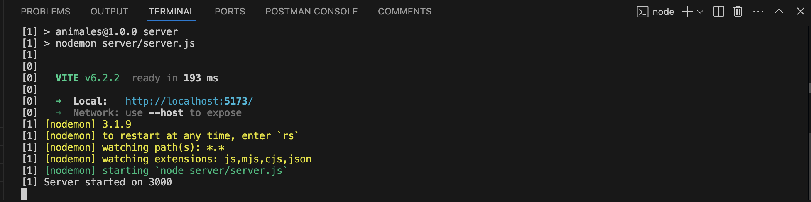

# Endangered Species Tracker🐾

Hey there! 👋 Thanks for checking out this app. It's designed to help scientists track sightings of endangered animals.

## Table of Contents
- [Prerequisites](#first-things-first---what-youll-need)
- [Installation](#okay-lets-get-this-show-on-the-road-)
- [Demo](#demo)

## First Things First - What You'll Need

Prior to running this project, here are the pre-reqs you'll need. Please make sure you've got these installed on your computer:

* **Node.js:** This runs the app. You'll want version 16 or later to keep things smooth.
* **npm** Node Package Manager.
* **PostgreSQL:** This is where we keep all our animal sighting data. Make sure it's up and running! I provide some mock data to get you started in my db.sql file.
* Keep in mind I use VS Code for my code editor and Mac Book

## Okay, Let's Get This Show on the Road! 🚀

Here's installation instructions to get the app running on your machine:

1.  **Grab the Code**

    First, you'll need to clone the repository. Basically, you're copying the code from GitHub to your computer. Pop this command into your terminal:

    ```bash
    git clone https://github.com/courjimen/Endangered-Animals.git
    ```

2.  **Get the Server and Client Folders Ready**

   Since I run this both folders concurrently, you will need to install the dependencies in the root of my project (at the same level of the client and server folders) Run this command:

    ```bash
    npm install
    ```

Once everything is installed you can run:

    ```bash
    npm run dev
    ```

This will run both folders and open the app. You should see this in your terminall:

    
3. **Set Up the Database - Let's Talk Animals! 🐘**

    * **Create a Database:** You'll need to create a PostgreSQL database. You can use tools like `psql` or pgAdmin. Just give it a name, like "animals".
    * **Tell the App How to Connect:** Open up `server/db.js` and fill in your database connection details (username, password, etc.).
    * **Fill the Database with Data:** We've got a handy SQL script in `server/db.sql`. Run this to create the tables and add some initial animal sightings:

        ```bash
        psql -d animals -f server/db.sql
        ```

        (Remember to replace "animals" with your database name!)

5.  **Fire It Up! 🔥**

    Finally, we're ready to run the app! Back in the main project directory, type:

    ```bash
    npm run dev
    ```

    This will start both the server and the client. You should be able to see the app in your browser at `http://localhost:5173/`. The server will be running on `http://localhost:3000/sightings` or /individuals endpoint.

And that's it! You're all set to track some amazing animals! 🎉